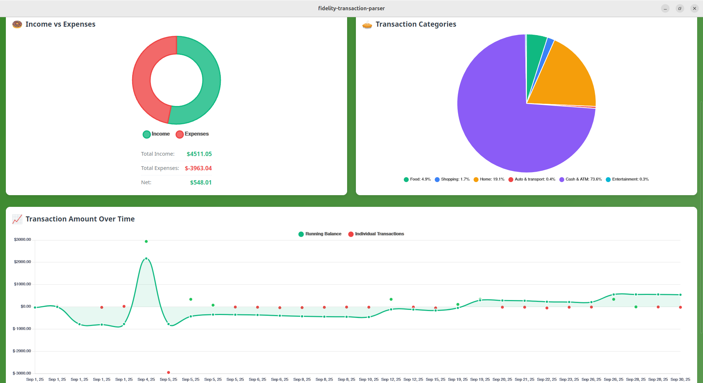

# 🏦 Fidelity Transaction Parser

A modern desktop application for parsing, analyzing, and visualizing financial transaction data from Fidelity CSV exports. Built with Tauri, Rust, Vue 3, and TypeScript.




## 📊 Data Processing

### Transaction Structure

```typescript
interface Transaction {
  date: string; // Transaction date
  description: string; // Transaction description
  amount: number; // Amount in cents
  account_name: string; // Account identifier
  category: string; // Primary category
  transaction_type: string; // "Income" or "Expenses"
  sub_category: string; // Detailed subcategory
  hidden: boolean; // Visibility flag
}
```

### CSV Format Support

The application expects Fidelity CSV exports with the following columns:

1. Date
2. Description
3. Amount
4. Account Name
5. Transaction Type
6. Category
7. Sub Category
8. Hidden (optional)

The CSV can be downloaded from Fidelity's website under the new version of Full View.
